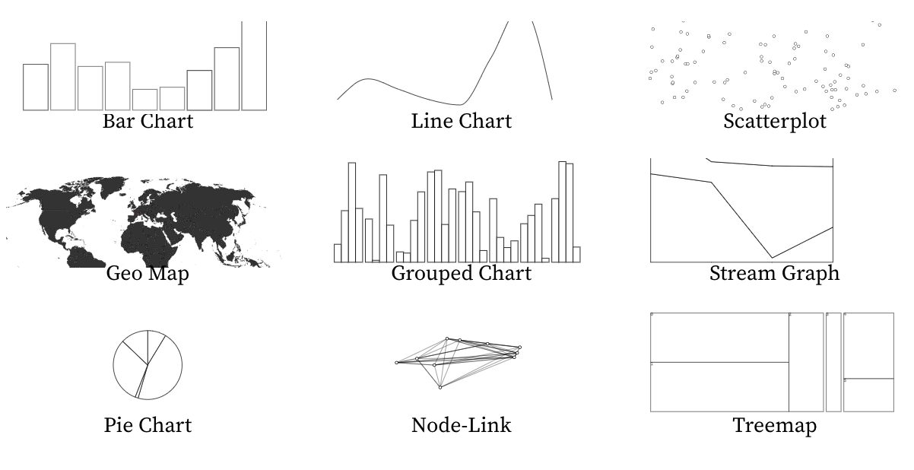

# Visualisation interactive de données

## Enseignants

**Romain Vuillemot**, *Centrale Lyon, Département Math-Info*.  
Email : romain.vuillemot@ec-lyon.fr // Site web : http://romain.vuillemot.net/

**Théo Jaunet**, *Centrale Lyon, Département Math-Info*.  
Email : theo.jaunet@ec-lyon.fr // Site web : https://theo-jaunet.github.io/

## Objectifs du cours

1. **Connaître les principales représentations graphiques**, savoir décomposer leur mapping visuel (marques et propriétés graphiques) avec les données (variables et valeurs)
2. **Maîtriser les méthodes d'exploration de données et prototypage** du jeu de données aux premières visualisations au moyen d'outils interactif en justifiant les choix de design
3. **Savoir implémenter un prototype** en technologies web (JS, D3, Observable) et leur déploiement avec une mise en page complète et des interactions appropriées

## Liens importants pour le cours

- [📝 Etudiants inscrits et groupes projets](https://docs.google.com/spreadsheets/d/1d6hA__7a3ytNYGjKvGQzw7GmZzhsHAulB5Qd2oSd_pk/edit?gid=563215406#gid=563215406)
- [📝 Formulaire de le rendu](https://docs.google.com/forms/d/e/1FAIpQLSfUTpN-1xVWplwF7wuUc8jLKVEZ2mwaXdsbfVtIZQc3s_5C3w/viewform)  des TPs
- [📊 Exemples de visualisations](https://docs.google.com/presentation/d/1JuBqMUw9xpZU7eXuYjwURr51K6fsDiA_ZjeQWtr3zrM/edit?usp=sharing)  (que nous discutterons en cours)

Documents à lire :

- [📖 Document de cadrage des projets](pdf/projets.pdf)
- [📖 Listes des ressources techniques à maîtriser pour le cours](https://partage.liris.cnrs.fr/index.php/s/oB3xG6drC9DGniA)
- [📖 Observable Plot Cheatsheet](https://github.com/observablehq/plot-cheatsheets/raw/main/plot-cheatsheets.pdf)

## Evaluation

_Le cours comporte au total **28 heures de face à face, divisées en 7 séances de 4h de cours+TP** et **1 séance de soutenance de projets**. La présence aux cours et TP est **obligatoire**. Tous les rendus sont à réaliser la veille du cours au plus tard (minuit). Aucun rendu tardif n'est pris en compte (ni par email ni par formulaire)._

- 40% note de projet / 20
- 40% note d'examen / 20
- 20% rendu des TPs (notes A/C/F)
- 10% participation (Bonus)
- Validation de la [compétence C1C3](https://www.ec-lyon.fr/formation/pedagogie/demarche-competences)

---

## Lundi 05/01/2026 08:00 - Séance 1 (4h)

### Cours 1 (2h)

  * [Présentation](https://docs.google.com/presentation/d/1YaPshJZLDj6M0XBMtmHqANeH17JINdB3Ie5G8RdC74U/edit) du cours et de l'activité projets
  * [Introduction à la visualisation](https://docs.google.com/presentation/d/1ZbHPdD8ok5fFEaaMG6kHULpg0S8j8jpVkVqvPw8QZDY/edit) avec exemples et définitions
  * [Outils de visualisations](https://docs.google.com/presentation/d/18b-B9wAYpq93nbROxRe9u6-7xexuBLM7T-yapqGoYdo/edit#slide=id.p) avec Tableau, D3, Observable Plots
  * [Début de l'activité projets](https://docs.google.com/presentation/d/1r96OLz_yDkkAsq6segP360Vnr_PJrboO5XEJb0lHgw4/edit#slide=id.g1c92aab52b4_0_12),  [document de cadrage](pdf/projets.pdf)

### TP 1 (2h)

* [Installer Tableau Public](https://public.tableau.com/app/discover) pour l'exploration visuelle de [jeux de données](dataset/)
* [TP 1 Tableau](pdf/tp1-tableau.pdf) : exploration de données Covid
* [Introduction à Observable](https://observablehq.com/) 

➡ Pour la prochaine séance

  * TP 1 à finir
  * 📖 S'auto-former à JavaScript, Observable ([exercices](https://observablehq.com/@observablehq/hands-on-tutorials-overview)) à réaliser, ne sont pas à rendre)
  * 📖 Projets : réfléchir à un groupe de projet et explorer les jeux de données fournis

---

## Lundi 12/01/2026 08:00 - Séance 2 (4h)

### Cours 2 

  * [Visualiser le temps](https://docs.google.com/presentation/d/1HPwRnoc5SvvuhCmxyKnljgqa0oRH6ugDlhM0JQ8qLmM/edit)
  * Cas d'études : [données climatiques](https://docs.google.com/presentation/d/1oalVDPAET17c_YuwezBAMoGCkWIQUI6MgZGwjZwyIiM/edit#slide=id.p) et [données covid](https://docs.google.com/presentation/d/1rj_m1uWkTc5-btxfKenx8xOhWGlhPeQ0Mhsw43UUjv0/edit#slide=id.gab70abed7c_0_258)
  * [Visualisation et Observable](https://docs.google.com/presentation/d/1owTM8-ru16kalVnWUyKwcwgHcUNTS5mE2ke1s7ne7m0/edit)
 
Exercices : 
  * Jeu de données [penguins](https://observablehq.com/@observablehq/plot-exploration-penguins) et [weather](https://observablehq.com/@observablehq/plot-exploration-weather)
  * [Tutorial timeline](https://observablehq.com/@observablehq/timeseries-workshop-materials?collection=@observablehq/tutorial) : [Part 1](https://observablehq.com/@observablehq/timeseries-workshop-part-1-the-basics), [Part 2](https://observablehq.com/@observablehq/timeseries-workshop-part-2-discovering-date-patterns), [Part 3](https://observablehq.com/@observablehq/timeseries-workshop-part-3-looking-more-deeply-at-the-data) 
 

### TP 2 

  * [TP 2 Observable](pdf/tp2-observable.pdf) : exercice de visualisation de données
  * [Notebook](https://observablehq.com/d/34c6fdb00abf7f19) de chargement des données 
  
➡ Pour la prochaine séance

  * TP 2 : à rendre (rendu individuel mais travail en binôme possible)
  * 📖 S'auto-former à : [SVG, CSS](https://observablehq.com/@nithyaramgopal/lab-1/2 ), [D3.JS](https://observablehq.com/@d3/learn-d3?collection=@d3/learn-d3) et ces [exercices](https://www.freecodecamp.org/learn/data-visualization/)
  * 📖 Projets : validation du sujet de projet (par le responsable du cours) et cahier des charges (lien à inscrire sur le document du cours)

---

## Lundi 19/01/2026 08:00 - Séance 3 (4h)

### Cours 3

* [Visualiser l'espace](https://docs.google.com/presentation/d/1fY3EHmalb53aZVNYqv2UHjg9_kbtR26saexPTgPKKJs/edit)
* Cas d'étude visualisation de données sportive : [slides](https://docs.google.com/presentation/d/1eO-6XynpSwvpsu0d7jziMy7VDwANEEgnPMG9_0opTX4/edit),  [notebook](https://observablehq.com/@romsson/sports-data-analysis-and-visualization-ieee-vis-22)
* [Programmer en D3.JS](https://docs.google.com/presentation/d/1BtnZZoSmrafigZLbsFqPGwBlhPZHee19SJpUtcHKuCU/edit), [notebook du cours](https://observablehq.com/d/61a9193a258f6131)
* Notebook du cours ([24-25](https://observablehq.com/d/9e3d82561c534565)) et ([25-26](https://observablehq.com/d/3ae76e68284d7ebc))  

### TP 3 

  * [TP 3 Visualisations standards en D3.JS](pdf/tp3-standard.pdf) : scatterplot, bar chart, line chart.

➡ Pour la prochaine séance

  * TP 3 à rendre (travail et rendu individuel)
  * 📖 S'auto-former à D3 Avancé: [D3 part 2](https://observablehq.com/@uwdata/introduction-to-d3-part-2)
  * 📖 Projets : V1 du cahier des charges et explorations de données

---

## Lundi 26/01/2026 08:00 - Séance 4 (4h)

### Cours 4 

- [Visualisation et interaction](https://docs.google.com/presentation/d/1BOTQs-mzA9mZ323FuXuCgFeJZjNBPDz7jZQtNY9xlyI/edit)
- [Rôle de la couleur en visualisation](https://docs.google.com/presentation/d/1P-WKjOwfkyfpWerVYBX8BQmHUnKaO-SGEcLocbPH92E/edit)
- Layouts D3 avancés I : [grouped chart](https://docs.google.com/presentation/d/1ZbHPdD8ok5fFEaaMG6kHULpg0S8j8jpVkVqvPw8QZDY/edit#slide=id.g765aa770b7_0_108) ([notebook du cours](https://observablehq.com/d/c50fc359e0d9803e), [notebook 23-24](https://observablehq.com/d/652dbabedf245aea))
- Layouts D3 avancés II : stacked graphs, pie chart ([slides](https://docs.google.com/presentation/d/1a79MLat-ftU25Uk7uM2JYfDSlKS-9hp94EnmegvcLg0/edit#slide=id.p)) ([observable du cours](https://observablehq.com/d/bbe8f5e7f04b30cd)) ([23-24](https://observablehq.com/d/17206b80c861edd3))
- Méthode de prototypage de visualisation ([slides](https://docs.google.com/presentation/d/11kEkZK12C893qzyEDvkIjgFKPmRKFf-KDDOKiwGw6ys/edit)) 

 
### TP 4

- Prototypage papier des visualisations du projet (par groupe)

- Travail sur la V1 des projets, visulisations exploratoires (bar chart, scatterplot, line chart du TP 3) dans un notebook Observable et mettre lien dans la colonne H dans la liste des étudiants inscrits

➡ Pour la prochaine séance
  * Projets : ajouter le prototype papier au cahier des charges et commencer l'implémentation
  * 📖 Lire D3.js avancé : [Réseaux](https://livebook.manning.com/book/d3-js-in-action/chapter-6/81) et [Layouts](https://livebook.manning.com/book/d3-js-in-action/chapter-5/1)

---

## Lundi 02/02/2026 08:00 - Séance 5 (4h)

### Cours 5 

* Visualisations de graphes, d'arbres et de réseaux ([slides](https://docs.google.com/presentation/d/1zhbOrcbVMEfnl8tx07TPNuY8oEIeGyuYVeCR5Rb4h9g/edit#slide=id.p))
* Cas d'étude visualisation du traffic routier : ([slides](https://docs.google.com/presentation/d/1kX4vkRbFAw5WMFnL0nDMLxA44rhp_ywtNxHCrGGr2ks/edit#slide=id.p))
- Layouts D3 avancés III : force-directed graphs, hierarchies, treemaps ([notebook](https://observablehq.com/d/f22153e092ceb9b1)) notebook 23-24 ([notebook](https://observablehq.com/d/9df305f79f3d43c6))
 

### TP 5

* [TP 4 Geo map](pdf/tp4-geo.pdf) : réaliser une carte géographique en D3
* Travail sur les projets (par groupe)

➡ Pour la prochaine séance

* TP 4 à rendre (travail et rendu par groupe de projet)
* Travail sur le projet (par groupe)

---

## Lundi 09/02/2026 08:00 - Séance 6 (4h)

### Cours 6 

- Visualiser le machine learning ([video](https://youtu.be/LNMxO9joI-U?t=5816), [slides](https://docs.google.com/presentation/d/16BWoESKZoydnzZl5h7NVVIG7ISi8LaiZj_mE7WvKDJc/edit), [notebook](https://observablehq.com/d/1992f2ee36fa33c1))

### TP 6 

* Finalisation d'une V1 du projet (par groupe, lien à inscrire sur le document du cours, colonne I).
* Activité de peer review de projet : [formulaire de peer review](https://docs.google.com/forms/d/1-ymQEXeIscPjmFX7AOvDWbOrmCsthYx6bwUcUsZ2s6U/edit) pour le groupe à évaluer (1 formulaire par groupe)

➡ Pour la prochaine séance

* Prise en compte des retours du peer review ([réponses](https://docs.google.com/spreadsheets/d/1DjvO0mmLOnIexK3PwjHQdYmnPWT1bjcWD4ieSAHgeoE/edit?resourcekey=&gid=118596929#gid=118596929))
* Préparer la présentation finale du projet

---

## Lundi 16/02/2026 08:00 

### Vacances

---

## Lundi 23/02/2026 08:00 - Séance 7 (4h)

- Séance de travail sur les projets, présentation d'une V2 et retours de l'encadrant de TP et du commenditaire.

### Séance de TP dédiée aux projets

---

## Lundi 02/03/2026 08:00 - Séance 8 (4h)

### Soutenance des projets

* Présence obligatoire pendant toute la durée de la séance
* 10min par groupes : 6min de présentation, 3min de questions, 1min d'installation
* Pas de slides, uniquement la page du projet

➡ Pour le 09/03/2026 12h (pas de séance)

* Prendre en compte les retours faits lors de la soutenance  afin d'améliorer votre projet
* Rendre le projet (voir détails dans la section suivante)
* Réviser l'examen

---

## Lundi 09/03/2026 - Pas de séance

### Rendu final des projets (heure limite : 12:00)

* Email avec l'URL vers le projet, code et tout autre livrable final à romain.vuillemot@ec-lyon.fr
* Sujet du mail : `[MOS-VISU] Rendu final projet - Groupe X`
* Indiquer les changements pris en compte depuis la soutenance
* Ne plus modifier le code ensuite

---

## Mardi 10/03/2026 08:00 - Examen (2h)

* Examen sur papier (exemple de sujet [ici](pdf/exam.pdf))
* Aucun support de cours autorisé
* Amener stylos et crayons de couleurs pour dessiner une visualisation

---

## Liens

Programmation web

- HTML et CSS https://www.w3.org/Style/Examples/011/firstcss.en.html
- SVG https://oreillymedia.github.io/Using_SVG/guide/markup.html
- Manipulation du DOM en JS https://developer.mozilla.org/en-US/docs/Learn/JavaScript/Client-side_web_APIs/Manipulating_documents
- Comment fonctionne un navigateur https://developers.google.com/web/updates/2018/09/inside-browser-part1

Introduction aux notebooks Observable

* https://observablehq.com/tutorials
* https://observablehq.com/@neocartocnrs/tuto
* https://observablehq.com/@ianarawjo/svg-html-tag-tutorial

Apprendre JavaScript

* https://developer.mozilla.org/en-US/docs/Web/JavaScript/Guide
* https://developer.microsoft.com/en-us/javascript/
* https://javascript.info/
* https://exploringjs.com/impatient-js/toc.html
* https://learnvanillajs.com/
* Algorithmes en JavaScript https://github.com/trekhleb/javascript-algorithms
* Eloquent JavaScript https://eloquentjavascript.net/
* JavaScript et science des données http://js4ds.org/
* JavaScript modules https://ultimatecourses.com/blog/mastering-the-module-pattern

Autres cours

* https://courses.cs.washington.edu/courses/cse512/16sp/
* https://courses.cs.washington.edu/courses/cse412/21sp/index.html
* https://vis.csail.mit.edu/classes/6.859/

